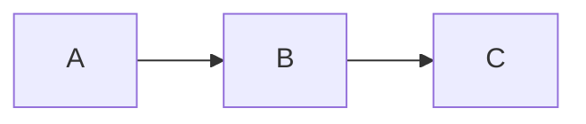

# Markdown Specification

## When I Speak Up

This skill activates when the conversation involves:

**Planning/Design:**
- Designing documentation structure
- Planning markdown-based content systems
- Choosing markdown flavors (CommonMark, GFM, MDX)
- Architecting documentation sites

**Implementation:**
- Writing markdown content
- Creating tables, code blocks, links
- Building documentation with markdown
- Implementing markdown parsers/renderers

**Guidance/Best Practices:**
- Markdown syntax questions
- Differences between CommonMark, GFM, MDX
- Rendering library selection
- Documentation structure patterns

**Review/Validation:**
- Markdown formatting correctness
- Link validation
- Documentation clarity and structure
- Accessibility of markdown content

---

## Key Principles

- **CommonMark**: The standard specification; consistent across renderers
- **GFM (GitHub Flavored Markdown)**: CommonMark + tables, strikethrough, autolinks, task lists
- **Semantic structure**: Use headings for hierarchy, not styling
- **Accessibility**: Alt text for images, descriptive link text
- **Portability**: Stick to common syntax for cross-platform compatibility

---

## Patterns We Use

### Headings

```markdown
# H1 - Document Title (one per document)
## H2 - Major Sections
### H3 - Subsections
#### H4 - Details
##### H5 - Rarely needed
###### H6 - Almost never needed
```

Alternative syntax (less common):
```markdown
Heading 1
=========

Heading 2
---------
```

### Text Formatting

```markdown
**Bold text** or __bold__
*Italic text* or _italic_
***Bold and italic*** or ___both___
~~Strikethrough~~ (GFM)
`Inline code`
```

### Links

```markdown
[Link text](https://example.com)
[Link with title](https://example.com "Title on hover")
[Reference link][ref-id]
[Implicit reference][]

[ref-id]: https://example.com
[Implicit reference]: https://example.com

<!-- Autolinks (GFM) -->
https://example.com
<email@example.com>
```

### HTML Anchors for Navigation Targets

HTML anchors create navigation targets within markdown documents for same-page and cross-file linking.

**Single Anchor:**
```markdown
<a id="section-name"></a>

## Section Heading
```

**Grouped Anchors (for requirements tables):**
```markdown
<a id="req-f-001"></a><a id="req-f-002"></a><a id="req-f-003"></a>

| ID | Requirement | Priority |
```

**Anchor Placement Rules:**
- Anchors on their own line
- All anchors for a section on **one line** (not separate lines)
- Blank line above and below anchor block
- Anchor IDs are lowercase with hyphens: `req-f-001`, not `REQ-F-001`

**Linking to Anchors:**

Same-page:
```markdown
See [REQ-F-001](#req-f-001) for details
```

Cross-file:
```markdown
See [REQ-F-001](requirements-catalog.md#req-f-001)
See [REQ-F-001](../requirements/requirements-catalog.md#req-f-001)
```

**Note:** Cross-file fragment navigation is renderer-dependent (see "Cross-File Linking Limitations" section).

### Images

```markdown


![Alt text][image-ref]

[image-ref]: image.png "Title"
```

### Lists

```markdown
<!-- Unordered -->
- Item 1
- Item 2
  - Nested item
  - Another nested
- Item 3

<!-- Ordered -->
1. First
2. Second
   1. Nested ordered
3. Third

<!-- Mixed -->
1. Ordered item
   - Unordered nested
   - Another

<!-- Task lists (GFM) -->
- [ ] Unchecked task
- [x] Completed task
```

### Code

Inline:
```markdown
Use `const` for constants.
```

Fenced code blocks:
````markdown
```javascript
function hello() {
  console.log('Hello, world!');
}
```
````

Indented code block (4 spaces):
```markdown
    function hello() {
      console.log('Hello');
    }
```

### Tables (GFM)

```markdown
| Header 1 | Header 2 | Header 3 |
|----------|:--------:|---------:|
| Left     | Center   | Right    |
| Cell     | Cell     | Cell     |

<!-- Alignment -->
|:---| Left
|:--:| Center
|---:| Right
```

### Blockquotes

```markdown
> Single line quote

> Multi-line quote
> continues here

> Nested quotes
>> Go deeper
>>> Even deeper
```

### Horizontal Rules

```markdown
---
***
___
```

### Line Breaks

```markdown
Hard break: End line with two spaces
Or use HTML: <br>

Soft break (ignored):
This continues same paragraph
```

### Escaping

```markdown
\*Not italic\*
\# Not a heading
\[Not a link\]
\`Not code\`
```

Characters that can be escaped:
```
\ ` * _ { } [ ] ( ) # + - . ! |
```

---

## Extended Syntax (GFM and Others)

### Footnotes

```markdown
Here's a statement[^1] with a footnote.

[^1]: This is the footnote content.
```

### Definition Lists (some parsers)

```markdown
Term
: Definition

Another term
: Another definition
```

### Abbreviations (some parsers)

```markdown
The HTML specification is maintained by the W3C.

*[HTML]: Hyper Text Markup Language
*[W3C]: World Wide Web Consortium
```

### Math (KaTeX/MathJax)

```markdown
Inline math: $E = mc^2$

Block math:
$$
\frac{n!}{k!(n-k)!} = \binom{n}{k}
$$
```

### Mermaid Diagrams

````markdown

````

### Admonitions/Callouts (various parsers)

```markdown
> [!NOTE]
> This is a note.

> [!WARNING]
> This is a warning.

> [!TIP]
> This is a tip.
```

---

## Cross-File Linking Limitations

**Fragment identifiers (`#anchor`) work differently across markdown renderers.**

### Same-Page Navigation

Fragment identifiers work consistently across all renderers for same-page navigation:

```markdown
[Jump to section](#section-name)
```

This works in GitHub, GitLab, VS Code, and Chrome extensions.

### Cross-File Navigation

Fragment identifiers are **renderer-dependent** for cross-file links:

```markdown
[See requirement](requirements-catalog.md#req-f-001)
```

**Behavior by renderer:**
- **GitHub/GitLab**: Opens file and scrolls to anchor
- **VS Code**: Opens file and scrolls to anchor
- **Chrome markdown viewer extensions**: Opens file but **drops fragment** (does not scroll)

**Why This Matters:**

Chrome extensions (Markdown Viewer, Markdown Preview Plus) strip the `#anchor` portion during cross-file navigation. The target file opens, but you land at the top of the document, not at the target section.

### Mitigation Strategy

**Place anchors at section boundaries** so readers land near the content even when fragment navigation fails:

```markdown
### 2. Universal Identifiers (4 requirements)

<a id="req-f-003"></a><a id="req-f-004"></a><a id="req-f-005"></a><a id="req-f-022"></a>

| ID | Requirement | Priority |
```

By grouping all anchors on one line immediately above the table, the reader sees the target content even if the renderer doesn't scroll to the exact anchor.

**Alternative:** Use heading-based anchors when possible (auto-generated from `## Heading` syntax). These have better renderer support but don't work well for table rows.

---

## Anti-Patterns to Catch

| Anti-Pattern | Why It's Bad | Do This Instead |
|--------------|--------------|-----------------|
| Multiple H1 headings | Breaks document hierarchy | One H1, use H2+ for sections |
| Skipping heading levels | Confuses screen readers | H1 > H2 > H3 sequentially |
| "Click here" links | Bad accessibility | Use descriptive link text |
| Missing alt text | Images invisible to screen readers | Always provide alt text |
| Huge tables | Unreadable on mobile | Consider lists or split tables |
| Raw URLs | Less accessible | Use descriptive link text |
| Inconsistent list markers | Visual noise | Stick to one style (- or * or +) |
| Multiple anchors on separate lines | Creates visible whitespace gaps between heading and content | Put all anchors for a section on one line |

---

## Quick Reference

### Markdown Flavors

| Flavor | Features | Use Case |
|--------|----------|----------|
| CommonMark | Core spec, consistent | General markdown |
| GFM | Tables, task lists, autolinks | GitHub, GitLab |
| MDX | JSX components in markdown | React documentation |
| Markdown Extra | Definition lists, footnotes | PHP, some CMSs |
| MultiMarkdown | Metadata, cross-references | Academic writing |

### Popular Parsers/Renderers

| Library | Language | Notes |
|---------|----------|-------|
| marked | JavaScript | Fast, GFM support |
| markdown-it | JavaScript | Extensible, plugins |
| remark | JavaScript | AST-based, MDX support |
| CommonMark.js | JavaScript | Reference implementation |
| Python-Markdown | Python | Extensible |
| Goldmark | Go | Fast, CommonMark compliant |
| Pandoc | Haskell | Universal document converter |

### HTML in Markdown

Most parsers allow inline HTML:

```markdown
This is <strong>bold</strong> using HTML.

<div class="custom">
  Custom HTML block
</div>

<!-- Comments work too -->
```

### Front Matter (YAML)

```markdown
---
title: Document Title
date: 2024-01-15
tags: [markdown, documentation]
---

# Content starts here
```

---

## Rendering in JavaScript

### marked

```javascript
import { marked } from 'marked';

const html = marked.parse('# Hello\n\nWorld');

// With options
marked.setOptions({
  breaks: true,      // Convert \n to <br>
  gfm: true,         // GitHub Flavored Markdown
  pedantic: false    // Don't be strict
});
```

### markdown-it

```javascript
import MarkdownIt from 'markdown-it';

const md = new MarkdownIt({
  html: true,        // Allow HTML
  linkify: true,     // Autoconvert URLs
  typographer: true  // Smart quotes, etc.
});

const html = md.render('# Hello\n\nWorld');
```

### remark (with plugins)

```javascript
import { remark } from 'remark';
import remarkHtml from 'remark-html';
import remarkGfm from 'remark-gfm';

const file = await remark()
  .use(remarkGfm)
  .use(remarkHtml)
  .process('# Hello\n\n| a | b |\n|---|---|\n| 1 | 2 |');

console.log(String(file));
```

---

## Accessibility

### Images

```markdown
<!-- Good: Descriptive alt text -->


<!-- Bad: No useful information -->


<!-- Decorative images (empty alt) -->

```

### Links

```markdown
<!-- Good: Descriptive -->
[Read the API documentation](api-docs.md)
[Download the 2024 annual report (PDF, 2MB)](report.pdf)

<!-- Bad: Non-descriptive -->
[Click here](api-docs.md)
[Link](report.pdf)
```

### Headings

```markdown
<!-- Good: Logical hierarchy -->
# Main Title
## Section A
### Subsection A.1
## Section B

<!-- Bad: Skipped levels -->
# Title
### Jumped to H3
```

---

## References

- [CommonMark Specification](https://spec.commonmark.org/)
- [GitHub Flavored Markdown Spec](https://github.github.com/gfm/)
- [Markdown Guide](https://www.markdownguide.org/)
- [Daring Fireball (Original)](https://daringfireball.net/projects/markdown/)
- [MDX Documentation](https://mdxjs.com/)
