# Mermaid Diagrams

## When I Speak Up

This skill activates when the conversation involves:

**Planning/Design:**
- Designing documentation with embedded diagrams
- Choosing diagram types for different use cases
- Planning visual representations of systems or processes
- Architecting diagram-heavy documentation

**Implementation:**
- Writing Mermaid syntax for various diagram types
- Embedding diagrams in markdown files
- Rendering Mermaid in web applications
- Styling and theming diagrams

**Guidance/Best Practices:**
- Mermaid syntax for specific diagram types
- When to use which diagram type
- Rendering options and libraries
- Accessibility and clarity

**Review/Validation:**
- Syntax validation for Mermaid code
- Diagram clarity and completeness
- Rendering compatibility

---

## Key Principles

- **Text-based**: Diagrams defined in plain text, version-controllable
- **Markdown-friendly**: Native support in GitHub, GitLab, many tools
- **Type-specific syntax**: Each diagram type has unique keywords
- **Direction matters**: LR, TB, RL, BT control flow direction
- **Keep it simple**: Overly complex diagrams lose clarity

---

## Patterns We Use

### Flowchart

Basic flowchart with different node shapes:

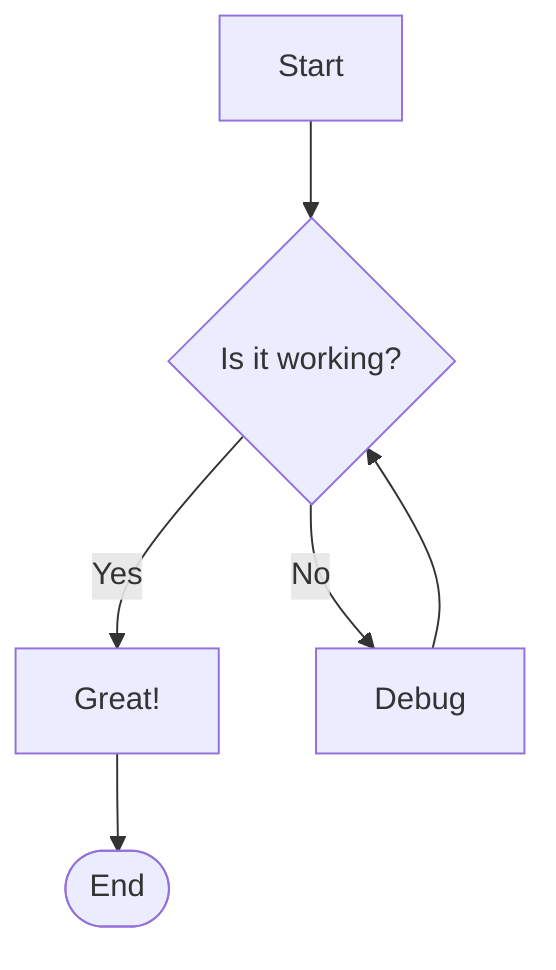

Node shapes:
- `[text]` - Rectangle
- `(text)` - Rounded rectangle
- `([text])` - Stadium/pill shape
- `{text}` - Diamond (decision)
- `[[text]]` - Subroutine
- `[(text)]` - Cylinder (database)
- `((text))` - Circle
- `>text]` - Flag/asymmetric

Direction options:
- `TD` / `TB` - Top to bottom
- `LR` - Left to right
- `RL` - Right to left
- `BT` - Bottom to top

### Sequence Diagram

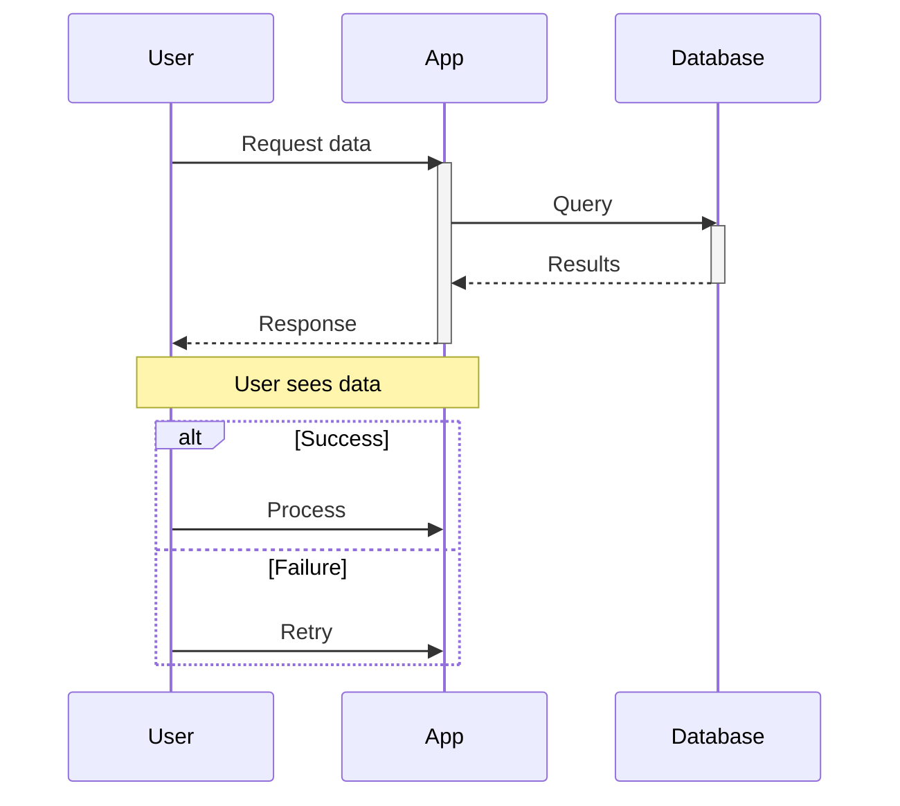

Arrow types:
- `->` Solid line without arrow
- `-->` Dotted line without arrow
- `->>` Solid line with arrow
- `-->>` Dotted line with arrow
- `-x` Solid line with X (async)
- `--x` Dotted line with X

### Class Diagram

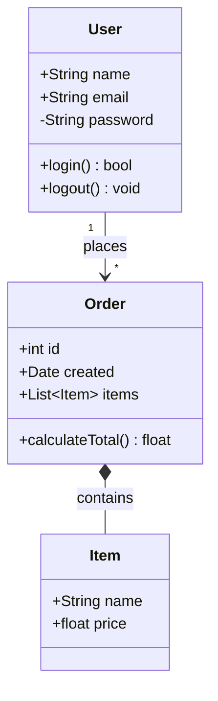

Relationships:
- `<|--` Inheritance
- `*--` Composition
- `o--` Aggregation
- `-->` Association
- `--` Link (solid)
- `..>` Dependency
- `..|>` Realization
- `..` Link (dashed)

### Entity Relationship Diagram

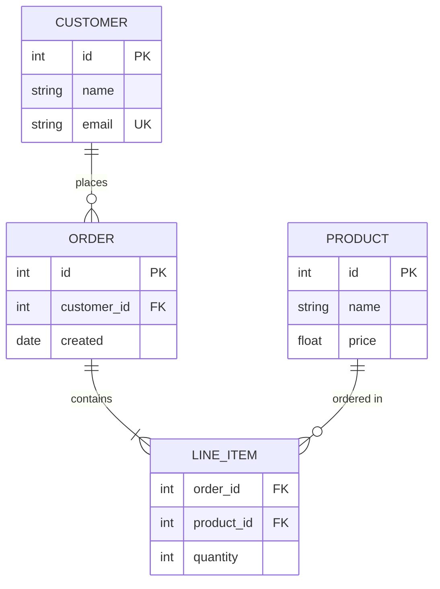

Relationship notation:
- `||` Exactly one
- `o|` Zero or one
- `}|` One or more
- `o{` Zero or more

### State Diagram

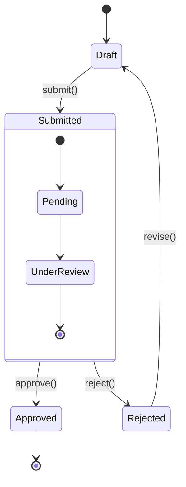

### Gantt Chart

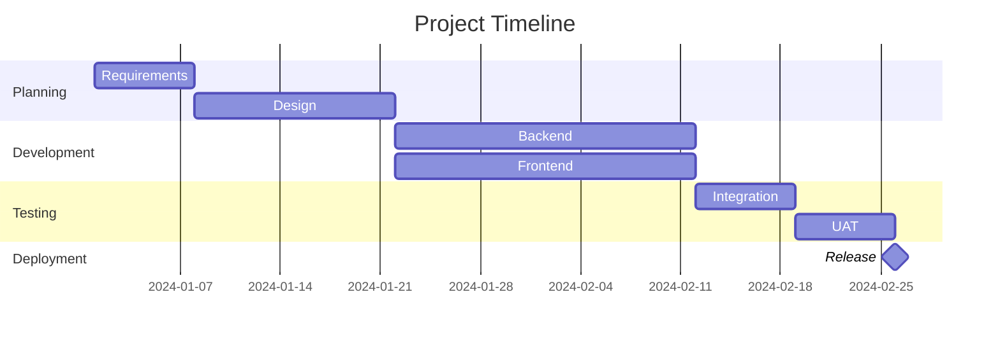

### Pie Chart

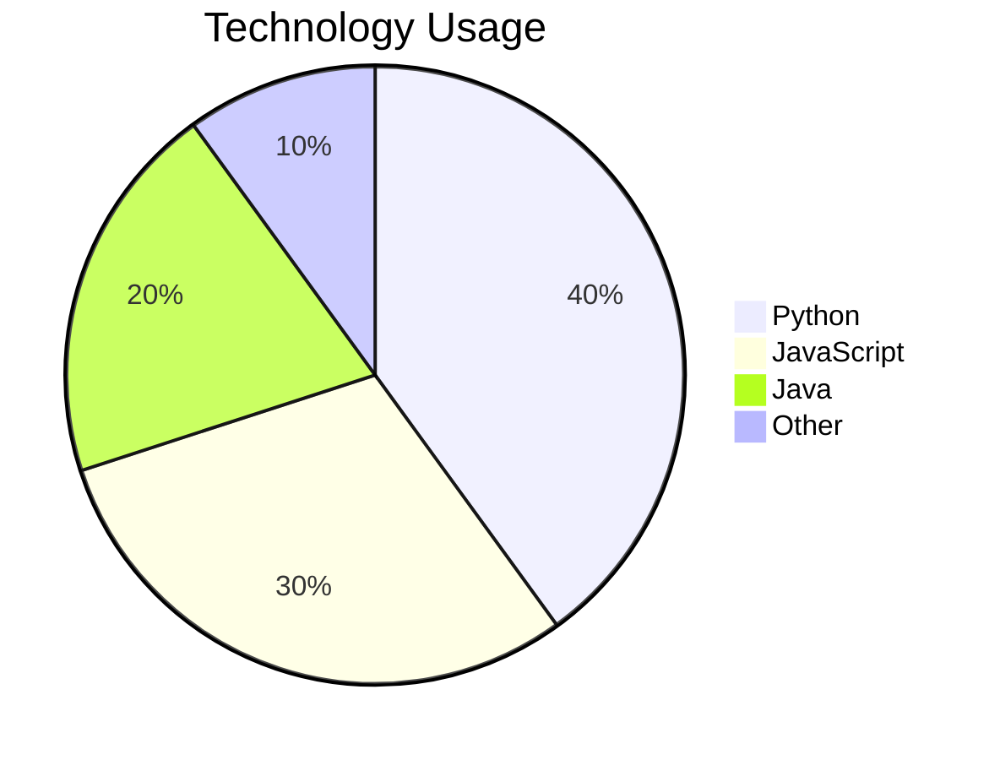

### Git Graph

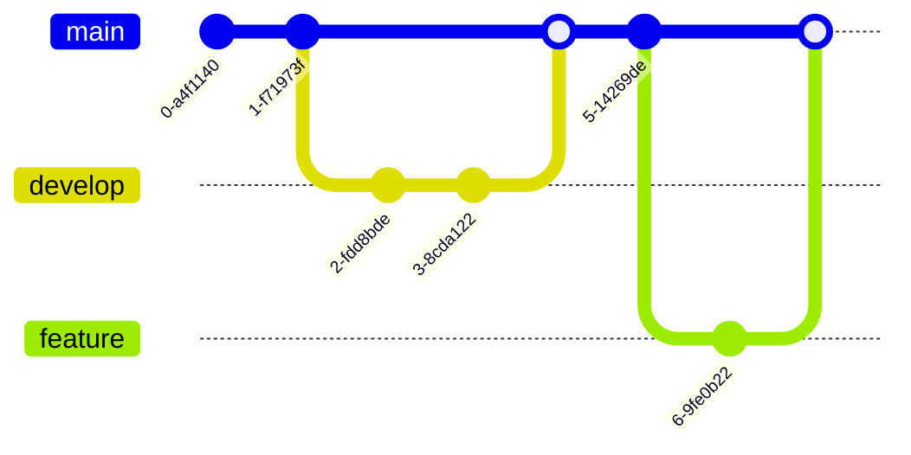

---

## Styling

### Theme Configuration

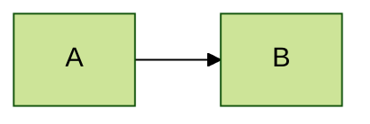

Available themes: `default`, `forest`, `dark`, `neutral`, `base`

### Custom Styles

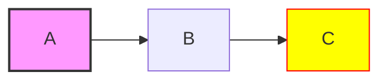

### Inline Styling

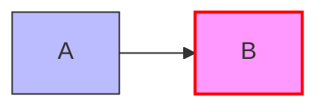

---

## Anti-Patterns to Catch

| Anti-Pattern | Why It's Bad | Do This Instead |
|--------------|--------------|-----------------|
| Too many nodes | Diagram becomes unreadable | Split into multiple diagrams |
| Crossing lines everywhere | Hard to follow flow | Reorganize or use subgraphs |
| Inconsistent direction | Confusing flow | Stick to one direction |
| No labels on edges | Unclear relationships | Add descriptive labels |
| Tiny text in large diagrams | Unreadable when scaled | Keep diagrams focused |
| Wrong diagram type | Misrepresents relationships | Match diagram to data structure |

---

## Quick Reference

### Embedding in Markdown

````markdown

````

### Embedding in HTML

```html
<script src="https://cdn.jsdelivr.net/npm/mermaid/dist/mermaid.min.js"></script>
<script>mermaid.initialize({startOnLoad: true});</script>

<pre class="mermaid">
flowchart LR
    A --> B
</pre>
```

### JavaScript Rendering

```javascript
import mermaid from 'mermaid';

mermaid.initialize({
  startOnLoad: true,
  theme: 'default',
  securityLevel: 'loose'
});

// Render specific element
const element = document.querySelector('.mermaid');
const graphDefinition = 'flowchart LR\n  A --> B';
const { svg } = await mermaid.render('graph-id', graphDefinition);
element.innerHTML = svg;
```

### Diagram Type Summary

| Type | Use Case | Keyword |
|------|----------|---------|
| Flowchart | Process flows, decision trees | `flowchart` |
| Sequence | API calls, interactions | `sequenceDiagram` |
| Class | Object relationships | `classDiagram` |
| ERD | Database schema | `erDiagram` |
| State | State machines | `stateDiagram-v2` |
| Gantt | Project timelines | `gantt` |
| Pie | Proportions | `pie` |
| Git | Branch history | `gitGraph` |
| Mindmap | Hierarchical ideas | `mindmap` |
| Timeline | Chronological events | `timeline` |

### Special Characters

```mermaid
flowchart LR
    A["Text with (parentheses)"]
    B["Text with [brackets]"]
    C["Text with {braces}"]
    D["Unicode: &#9733; star"]
```

---

## References

- [Mermaid Documentation](https://mermaid.js.org/intro/)
- [Mermaid Live Editor](https://mermaid.live/)
- [GitHub Mermaid Support](https://docs.github.com/en/get-started/writing-on-github/working-with-advanced-formatting/creating-diagrams)
- [Mermaid CLI](https://github.com/mermaid-js/mermaid-cli)
